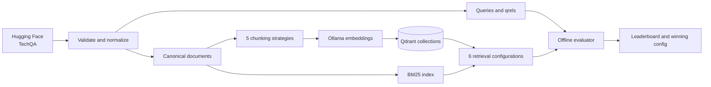

# ResolveRAG

An evaluation-first retrieval platform for building reproducible, local RAG systems over
real-world technical-support documentation.

ResolveRAG turns the IBM TechQA benchmark into a controlled retrieval experiment: five
chunking strategies are crossed with six retrieval configurations, then compared using
document-level relevance metrics, latency, and reproducibility metadata. The entire stack runs
locally with Python, LangChain, Ollama, and Qdrant.

> **Project status:** ResolveRAG provides a complete, reproducible pipeline for TechQA ingestion,
> multi-strategy chunking, Qdrant indexing, six retrieval configurations, and offline retrieval
> evaluation.

## What this project demonstrates

- Reproducible ingestion from a pinned Hugging Face dataset revision with SHA-256 verification
- Strict separation between indexable documents and benchmark questions/answers to prevent
  evaluation leakage
- Five configurable chunking strategies, including parent-child retrieval
- Six sparse, dense, hybrid, diversity-aware, and reranked retrieval configurations
- Local embeddings through Ollama and isolated collections in a pinned Qdrant server
- A resumable 5 × 6 experiment matrix with Recall@k, MRR@10, nDCG@10, and p50/p95 latency
- Experiment manifests that record configuration, data, index, model, dependency, and Git
  provenance
- Production-oriented engineering: typed configuration, stable IDs, integrity checks, unit
  tests, linting, static type checking, and an 80% coverage gate

## System design



The application owns its domain models and configuration contracts. LangChain is used at the
model and text-splitting boundaries, while Qdrant and reranking implementations remain behind
application-owned retrieval interfaces. See [the architecture document](docs/architecture.md)
for the component boundaries and data flow.

## Experiment matrix

| Chunking strategy | Purpose |
| --- | --- |
| Fixed 256 tokens | Higher-granularity baseline with 32-token overlap |
| Fixed 512 tokens | Larger-context baseline with 64-token overlap |
| Recursive | Paragraph-aware splitting that backs off through smaller separators |
| Sentence window | Semantically coherent five-sentence windows |
| Parent-child | Embeds small child chunks but returns their larger parent context |

| Retrieval configuration | Purpose |
| --- | --- |
| BM25 | Lexical sparse-retrieval baseline |
| Dense | Cosine similarity over `nomic-embed-text` vectors |
| Dense MMR | Dense retrieval with a relevance/diversity trade-off |
| Hybrid RRF | Rank-based fusion of BM25 and dense candidates |
| Hybrid weighted | Normalized score fusion with configurable dense weighting |
| Hybrid rerank | Hybrid candidates reranked by a MiniLM cross-encoder |

Evaluation is performed after document-level deduplication. The configured benchmark reports
Recall@1/5/10, MRR@10, nDCG@10, failure counts, and steady-state p50/p95 retrieval latency.

## Dataset

The project uses [`nvidia/TechQA-RAG-Eval`](https://huggingface.co/datasets/nvidia/TechQA-RAG-Eval),
NVIDIA's RAG-ready distribution of the
[IBM Research TechQA dataset](https://github.com/IBM/techqa). The configuration pins an exact
dataset commit and source-file checksums.

The normalized local dataset contains:

- 28,481 technical-support documents
- 910 questions: 610 answerable and 300 unanswerable
- 600 development (`TRAIN_`) questions and 310 held-out (`DEV_`) questions

Configuration selection uses a deterministic, length-stratified sample of answerable `TRAIN_`
questions. `DEV_` remains untouched for final evaluation. Only documents enter the retrieval
indexes; questions, answers, and relevance judgments never do.

## Requirements

- macOS or Linux
- Python 3.12
- [`uv` 0.11.24](https://docs.astral.sh/uv/)
- [Ollama](https://ollama.com/) running locally
- Docker Desktop, OrbStack, or another Docker-compatible runtime
- Approximately 10 GB of free disk space for a full experiment

Qdrant runs in a pinned Docker container with a Docker-managed persistent volume. Its REST and
gRPC ports are bound to `127.0.0.1`, preventing unauthenticated access from other machines on the
network. The managed volume also avoids the filesystem-caching risks of macOS bind mounts.

## Quick start

### 1. Install the locked environment

```bash
git clone https://github.com/Rathish-Rajendran/ResolveRAG.git
cd ResolveRAG
uv sync --locked
```

### 2. Start Ollama and install the embedding model

```bash
ollama serve
```

In another terminal:

```bash
ollama pull nomic-embed-text
```

### 3. Start Qdrant

```bash
make qdrant-up
```

This starts `qdrant/qdrant:v1.19.1` and waits for its health endpoint before returning.

### 4. Download and prepare TechQA

```bash
uv run resolverag dataset prepare \
  --config configs/datasets/techqa.yaml
```

The command downloads the pinned inputs, verifies their checksums and schema, normalizes the
corpus, and writes the following Git-ignored artifacts:

```text
data/processed/techqa/
├── documents.jsonl
├── queries.jsonl
├── qrels.jsonl
└── manifest.json
```

See [the data guide](data/README.md) for provenance and split details.

### 5. Validate indexing on a bounded sample

```bash
uv run resolverag index build \
  --config configs/indexes/qdrant.yaml \
  --limit 25
```

This creates five smoke-test collections. Smoke and full builds use different names, preventing
a validation run from overwriting benchmark indexes.

### 6. Search a smoke index

```bash
uv run resolverag retrieve search \
  --index-manifest data/processed/techqa/indexes/smoke_25/manifest.json \
  --query "Which PHP vulnerability permits remote code execution?" \
  --strategy fixed_256 \
  --retriever hybrid_rerank \
  --top-k 5
```

Each result includes its document and chunk IDs, text, final score, and component scores such as
BM25, dense, fusion, MMR, or cross-encoder scores.

### 7. Validate the complete evaluation workflow

```bash
make benchmark-smoke
```

This exercises all 30 chunking/retrieval combinations over two queries. It validates the
pipeline; it is not a quality benchmark because the relevant documents may not be present in the
25-document smoke corpus.

## Run the full benchmark

On macOS, keep the machine awake and retain a log:

```bash
caffeinate -i make benchmark-overnight 2>&1 \
  | tee data/processed/techqa/overnight-benchmark.log
```

The evaluator checkpoints every completed query/configuration pair. If evaluation is interrupted
after indexing has completed, resume it without rebuilding the indexes:

```bash
caffeinate -i make benchmark-resume 2>&1 \
  | tee -a data/processed/techqa/overnight-benchmark.log
```

Do not rerun `benchmark-overnight` merely to resume evaluation. Rebuilding indexes produces a
new provenance fingerprint and therefore starts a distinct benchmark run.

The official run writes:

```text
reports/retrieval/full_development/
├── benchmark_manifest.json
├── retrieval_results.jsonl
├── retrieval_leaderboard.csv
├── benchmark_summary.md
└── winning_configuration.yaml
```

Only a full-corpus run over the configured matrix and sample size is marked `official`. Smoke
reports are labeled `VALIDATION ONLY` and excluded from Git.

Stop Qdrant without deleting its persistent indexes when the experiment is finished:

```bash
make qdrant-down
```

## Development

Run the complete local quality gate:

```bash
make check
```

Or run its parts independently:

```bash
make format
make lint
make typecheck
make test-unit
```

## Repository layout

```text
configs/                 Versioned dataset, index, retrieval, and evaluation settings
data/README.md           Dataset contract, provenance, and leakage policy
docker-compose.yml       Pinned, loopback-only Qdrant server and managed volume
docs/architecture.md     System boundaries and offline/online data flows
src/resolverag/data/     Download, validation, normalization, and serialization
src/resolverag/indexing/ Chunking, embedding, Qdrant indexing, and manifests
src/resolverag/retrieval Sparse, dense, hybrid, MMR, and reranked retrieval
src/resolverag/evaluation/ Metrics, matrix runner, checkpointing, and reports
tests/unit/              Deterministic unit tests for the core pipeline
```

## Reproducibility safeguards

- Dataset revision and source checksums are pinned in version control.
- Canonical documents, queries, and qrels are content-hashed.
- Chunks use deterministic UUIDv5 identifiers and preserve source traceability.
- Index collections are isolated by strategy and build scope.
- Runtime retrieval validates model dimensions and index/config compatibility.
- Benchmark resumption is rejected when provenance changes.
- The held-out split is excluded from configuration selection.

## Roadmap

- Run and publish the full retrieval leaderboard
- Add grounded answer generation with a local Ollama LLM
- Measure answer correctness, citation correctness/faithfulness, abstention quality, token usage,
  and estimated cost
- Expose the selected pipeline through a typed API with health checks and tracing
- Add a lightweight UI for interactive, cited technical-support answers
