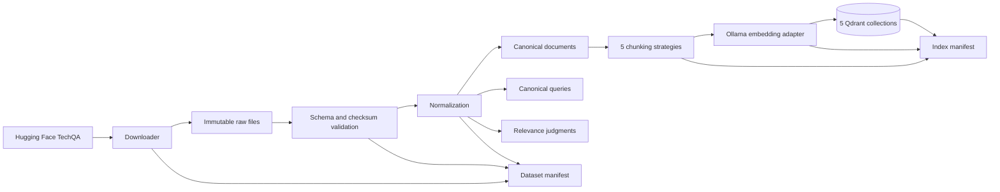
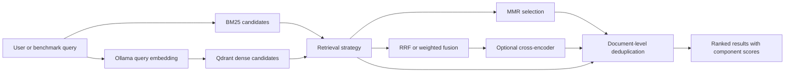
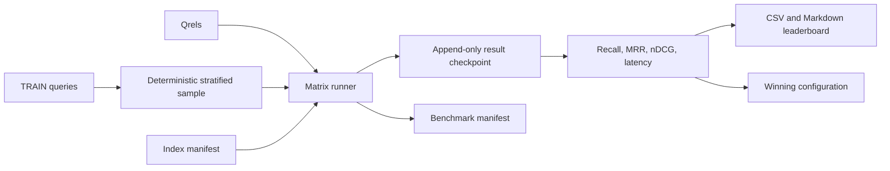

# ResolveRAG Architecture

**Status:** Retrieval platform implemented; generation and serving planned
**Last updated:** 2026-10-06

## 1. Purpose

ResolveRAG is an evaluation-first retrieval platform for technical-support RAG. It converts the
TechQA benchmark into reproducible document, query, relevance, index, and report artifacts. The
current implementation compares chunking and retrieval strategies; answer generation and
citation-faithfulness evaluation are the next system layer.

## 2. Goals

- Compare retrieval configurations with repeatable offline evaluation.
- Preserve document and chunk traceability for future cited answers.
- Prevent benchmark questions and answers from leaking into the retrieval index.
- Support fully local development with open-source models.
- Make every benchmark attributable to its data, configuration, index, dependencies, and Git
  state.
- Keep frameworks and providers replaceable behind application-owned interfaces.

## 3. Non-goals

- Fine-tuning a foundation model.
- Crawling arbitrary websites in real time.
- Training a new embedding or reranking model.
- Using held-out evaluation questions for configuration selection.
- Treating a smoke run as evidence of retrieval quality.
- Treating LLM-judge scores as the sole measure of answer quality.

## 4. Architectural principles

1. Raw source data is immutable.
2. External schemas are converted into canonical application models.
3. Domain models do not expose LangChain, Qdrant, or model-provider types.
4. Stable identifiers preserve document-to-chunk traceability.
5. Retrieval quality is measured before generation quality.
6. Every experiment is identified by versioned configuration and provenance.
7. The held-out split is protected from configuration selection.
8. The system fails explicitly on schema, checksum, model, or index incompatibility.

## 5. Implemented system context

ResolveRAG currently depends on:

- Hugging Face for the pinned NVIDIA distribution of IBM TechQA.
- Ollama and `nomic-embed-text` for local dense embeddings.
- a pinned Qdrant server container for persistent vector collections and payloads.
- `rank-bm25` for sparse retrieval.
- a sentence-transformers cross-encoder for reranking.
- LangChain model and text-splitting integrations at provider boundaries.

Developers operate the system through CLI commands for ingestion, indexing, retrieval, and
evaluation. No web application or production API is implemented yet.

## 6. Offline data and indexing flow



Only canonical documents can flow into chunking and indexing. Queries, reference answers, and
qrels are written to separate artifacts and used only by the evaluator.

## 7. Retrieval flow



All six retrieval configurations implement the same application-owned interface. Results retain
the canonical document ID, chunk ID, returned text, final score, and available component scores.
For parent-child retrieval, the child is embedded and matched while the larger parent text is
returned.

## 8. Evaluation flow

The evaluator creates the Cartesian product of five chunking strategies and six retrieval
configurations. It chooses a deterministic length-stratified sample of answerable development
questions, warms each runtime, records one result per query/configuration pair, and checkpoints
after each result.



Retrieval results are deduplicated to document level before relevance metrics are calculated.
The benchmark reports Recall@1/5/10, MRR@10, nDCG@10, failure count, and steady-state p50/p95
latency. Model and index initialization are excluded from latency measurements.

Resume is allowed only when the stored benchmark fingerprint still matches the current dataset,
index, and configuration provenance. A run is marked official only when it uses full indexes, the
entire configured matrix, and the configured sample size.

## 9. Component boundaries

| Component | Responsibility | Must not do |
| --- | --- | --- |
| `data` | Download, verify, normalize, validate, serialize | Chunk or index documents |
| `domain` | Stable application models | Import provider-specific model types |
| `indexing` | Chunk, embed, upload, and record index provenance | Read qrels or answers |
| `retrieval` | Build candidates, fuse, diversify, rerank | Calculate benchmark metrics |
| `evaluation` | Sample queries, run matrix, calculate and persist metrics | Mutate indexes |
| `cli` | Validate arguments and orchestrate application services | Contain retrieval algorithms |

## 10. Artifact contract

```text
data/raw/techqa/                         Downloaded pinned source files
data/processed/techqa/documents.jsonl    Index-eligible canonical documents
data/processed/techqa/queries.jsonl      Evaluation queries and reference answers
data/processed/techqa/qrels.jsonl        Query-to-document relevance judgments
data/processed/techqa/manifest.json      Dataset provenance and integrity metadata
data/processed/techqa/indexes/*/          Index manifests and chunk artifacts
qdrant_storage/                           Docker-mounted Qdrant server storage
reports/retrieval/*/                      Checkpoints, leaderboard, summary, winner
```

Generated data, model data, and smoke reports are excluded from Git. A completed official report
can be committed separately from the implementation so code history and experimental results
remain auditable.

## 11. Failure and integrity behavior

- Source downloads fail on checksum mismatch.
- Normalization fails on schema drift, duplicate query IDs, split violations, or inconsistent
  answerability labels.
- Index creation fails on an unexpected embedding dimension.
- Retrieval refuses an incompatible index configuration, model, dimension, backend, location,
  or chunk hash.
- Evaluation records individual retrieval failures without discarding completed work.
- Resume refuses to combine results from different provenance fingerprints.

## 12. Planned generation layer

The next layer will consume the selected retrieval configuration and add:

1. a local Ollama chat model with structured cited-answer output;
2. evidence sufficiency checks and explicit abstention;
3. citation validation against retrieved document and chunk IDs;
4. answer correctness, citation correctness/faithfulness, abstention, latency, and token metrics;
5. a typed API with health checks, tracing, and a small interactive client.

The generation layer will reuse the exact retrieval runtime selected by offline evaluation rather
than creating a separate, unmeasured retrieval path.
